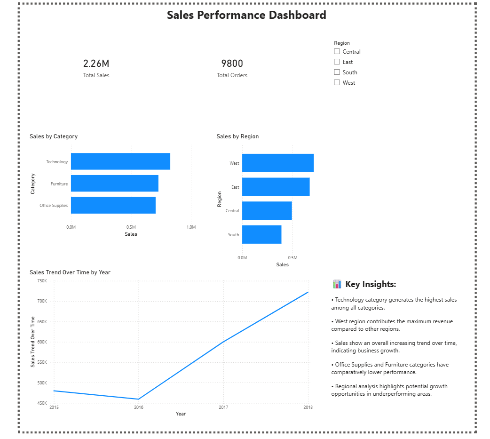

# 📊 Sales Analytics Dashboard

## Overview

This project is an interactive Power BI dashboard built to analyze sales performance across categories and regions.
The goal was to understand patterns in sales data and present them in a clear, visual way.

## What I Did

* Cleaned and explored the dataset
* Built KPI cards for Total Sales and Total Orders
* Created charts for category-wise and region-wise analysis
* Added a time-based trend analysis
* Implemented a slicer to filter data by region

## Key Insights

* Technology category contributes the highest sales
* West region performs better compared to others
* Sales show an overall upward trend over time
* Some categories contribute less and can be improved

## Tools Used

* Power BI
* CSV dataset

## Dashboard Preview

## What I learned

Working on this project helped me understand how to:

* turn raw data into meaningful insights
* design clean and readable dashboards
* think from a business perspective, not just a technical one

## Why This Project Matters

This project shows my ability to analyze real-world data and present insights using visualization tools. It reflects my interest in data-driven problem solving and business analytics.
